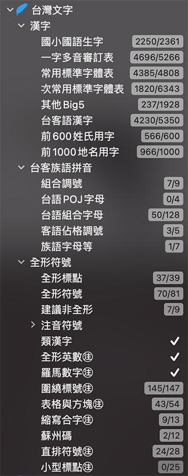
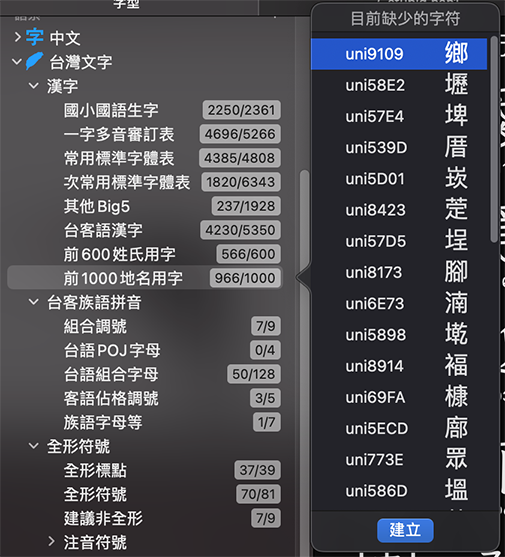
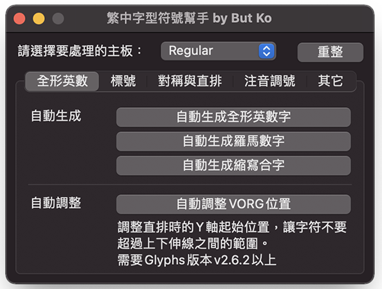
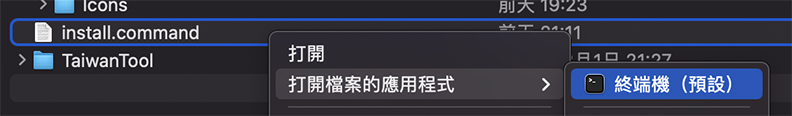

# ButTaiwanKit | But的台灣字型工具

## 台灣文字表

此工具是由兩部分組成，一為左側的字表（Info/Group-Taiwan.plist）。
注意，若您有自訂 Group.plist 檔案在先，在 Glyphs 2 下會被覆蓋，請做好備份。

此字表收錄了製作繁體中文字型時通常需要製作的符號、分類漢字表（如教育部字表、台客語漢字、姓氏與地名等），以及台客語拼音支援等。

在 Glyphs 3，右鍵選單會明確顯示出缺的字符是什麼字了，相當棒。可惜 Glyphs 2 還是只有顯示字符名稱。

分類名稱加有 ㊟ 的項目，是搭配下面腳本程式使用的。

## 繁中字型符號幫手

使用此腳本，可以將多數能夠程式化自動完成的符號字符全部自動產生完成。
包括：

* 做完半形符號後，自動產生全形符號。
* 自動產生圈號數字、括號數字的工具。
* 調整以上全形字符直排時上下方超界的字符（自動調整直排原點）。
* 自動鏡射、旋轉對稱的符號（也就是像括號、箭號等，只要製作一個，其他都可以自動產生出來）。
* 快速繪製產出表格符號的工具。

應該會讓製作符號的工程更快、更準確。

以上自動產出作業，都是以組件的方式生成的。除非自己拆開組件，否則都會跟著來源字符設計而跟隨改變，可保持兩者之間的一致性。

## 其他腳本

### 標註漢字字集

每次執行，會對目前整個字型裡每個字符標註他屬於哪些字集。由於是標註在 Note 裡，請安裝官方的 Glyph Notes 外掛，才能顯示內容。
請注意腳本執行後新增的字符不會標註，您可隨時執行一次更新資訊。

目前支援的字集如下：

* Big5-1: (台灣) Big5常用字
* Big5-2: (台灣) Big5次常用字
* TEdu-1: (台灣) 國字常用標準字體表
* TEdu-2: (台灣) 國字次常用標準字體表
* TTaike: (台灣) 台語或客語漢字
* JIS-1: (日本) JIS第一水準
* JIS-2: (日本) JIS第二水準
* JJoyo: (日本) 常用漢字表
* JJinmei: (日本) 人名用漢字表

### 擴大選取範圍到完整外框

由於中文字型外框總是非常多，筆畫多的字，選取起來非常擾人。要選一整個偏旁，不知道要滑鼠點兩下多少次。而且滑鼠點兩下時還很容易手賤不小心移動到選取的路徑。

是的，多數情況下，其實想選的是整個偏旁。這個腳本做的事情很簡單，就是將目前的選取範圍「擴大到完整路徑」。
也就是說您可以先隨便選取一整塊，只要每個外框都「沾上邊」，後來再執行這個腳本，就會擴大選取範圍到完整路徑了。
這可以相當加速選取整個偏旁的速度。

當然，每次用滑鼠執行此腳本會更慢。所以你應該做的是在偏好設定裡，對這個腳本設定快捷鍵。
我自己是指定 ctrl + F，不知道有沒有更順手的組合？（複製貼上順手的話應該是用 cmd，但 cmd 好像已經被官方定義差不多了...）

## 安裝

解開 ButTaiwanKit.zip 之後，右鍵點選 install.command ，選擇用終端機執行即可安裝。

有可能出現安全性警告，就勇敢接受他吧。

繁中字型符號幫手是基於 Python 與 vanilla 程式庫開發的，需要安裝相關程式庫。
安裝方法是：

### Glyphs 2

Glyphs > 偏好設定 > 外掛 > 模組 > 安裝模組

### Glyphs 3

視窗 > 外掛程式管理員 > 模組 ，請安裝 Python 與 Vanilla。

### 影片教學

完整的安裝與使用教學已經錄成 YouTube 影片，可在此網址觀看：
https://youtube.com/playlist?list=PL5uJ1QN0G69n69qHHexFMeKV2cnBpzNmb

影片裡當時是介紹手動複製方式安裝，透過 install.command 安裝可跳過手動複製的動作（容易不小心覆蓋整個資料夾，比較危險）。
