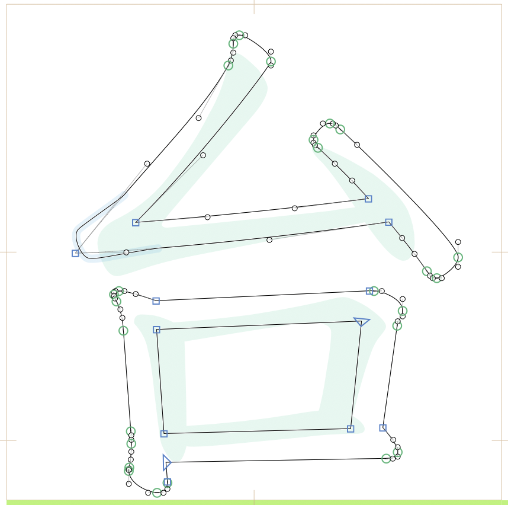

# Show Character Background | 背景字 | 背景文字

Glyphs.app plug-in for displaying working character in assigned font for the glyph you are editing.
After installation, turn it on or off by choosing *View > Show Character Background* (zh-Hant: 背景字, ja: 背景文字)

這是一個 Glyphs 外掛程式，可在字符編輯畫面背景顯示此文字在其他字型的外型。您可以指定多個字型。
在安裝外掛程式後，別忘記點選 顯示 > 背景字 (en: *Show Character Background*) 打開它。

これは Glyphs のプラグインで、グリフの編集ビューの背景に指定されたフォントで文字を表示することができます。
インストールして、メニューの 表示 > 背景文字を表示 でオンにしてください。

## Custom Parameter | 自訂參數 | カスタムパラメータ

### `CharBG Fonts`

`Font Name 1; Font Name 2, 60; Font Name 3, -40`

ex.
`源石黑體 B;BiauKai, -30; 楷體-繁, -140`

指定要顯示的字型。字型名稱可以是家族名稱，也可以包含字重的完整名稱，只要 Mac 可以識別就好。無法識別的字型會自動跳過。
要指定不只一個字型時，請用分號 `;` 隔開。（指定不只一種字型時，請用右鍵選單依序切換。）
若需要調整文字高度（中文字型常有每套基線位置不一樣的問題），可於字型名稱後以逗號隔開加上數值，表示要上移多少。若要下移則請寫負值。

未設定此變數時，本外掛沒有作用。

表示させたいフォントを指定します。フォント名はファミリー名でもウエイトも含めたフールネームでも構いません。認識できないフォント名は無視されます。
一つ以上指定したい場合はセミコロン `;` で区切ってください。（複数している場合は、コンテキストメニューで切り替えてください。）
Y 軸をシフトしたい場合は、コマンの後ろに数値を入れてください。

このパラメータがしておかないとこのプラグインは作動しません。

### `CharBG Color`

指定背景字顯示的顏色，請用 `RRGGBB` 格式書寫。若要指定透明度，請寫成 `RRGGBBAA`。

背景文字の色を指定することも可能です。 `RRGGBB` の16進数で指定してください。透明度（アルファ値）を `RRGGBBAA` のように指定することも可能です。

## Requirements

The plug-in works both in Glyphs 2 and Glyphs 3. I can only test it in latest app, and perhaps it crashs on earlier versions.

此外掛程式適用於 Glyphs 2 與 Glyphs 3，但只在目前最新版本測試過。

このプラグインは Glyphs 2 と Glyphs 3 に対応しています。ただし最新バージョンでしかテストしていません。

## License

Copyright 2021 But Ko (@buttaiwan).
Based on sample code by Georg Seifert (@schriftgestalt).

Licensed under the Apache License, Version 2.0 (the "License");
you may not use this file except in compliance with the License.
You may obtain a copy of the License at

http://www.apache.org/licenses/LICENSE-2.0

See the License file included in this repository for further details.
