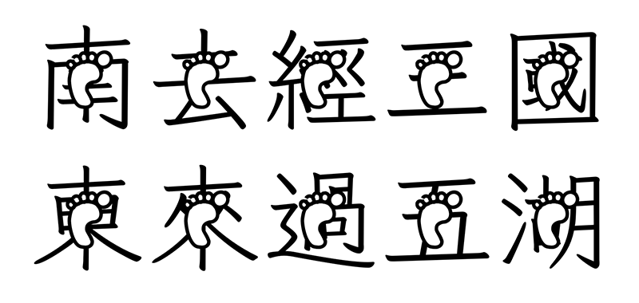
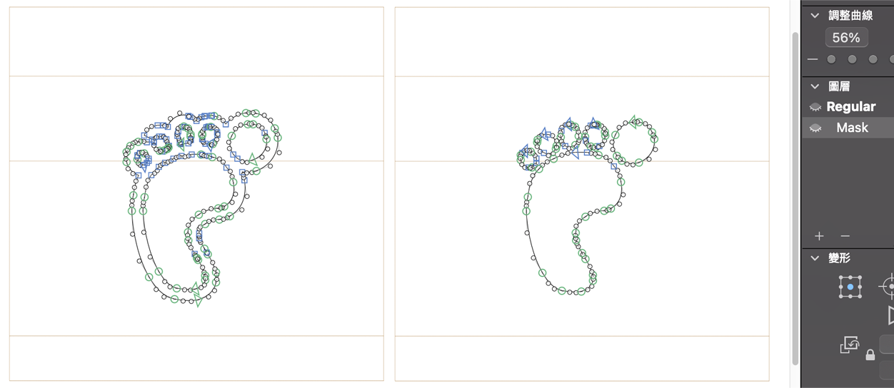
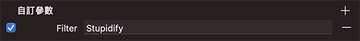

# Stupidify | 耍笨 | ふざける

這是一個 Glyphs 外掛程式，可將編輯中的字型與特定字符合成，產出金◯風格的字型。
每個語系、每個主板的疊合圖是分開的，可以定義不同的疊合圖案。
可以從 濾鏡 > 耍笨 (en: *Stupidify*) 執行它，也可以設定在實體的自訂變數匯出時套用。

## How to use | 使用方式

1. 建立新字符來設計你要疊合的圖案。字符名稱必須是 `_stupid.XXX`，其中 *XXX* 表示文字語系，例如 *_stupid.han* (漢字), *_stupid.kana* (假名), *_stupid.bopomofo* (注音), *_stupid.hangul* (韓文)...，或是也可建立 `_stupid.any` 適用於所有文字（但應該沒什麼用）。
2. 若有需要挖空的地方，可建立名為 `Mask` （大小寫需一樣）的圖層設計遮罩。
3. 點選 濾鏡 > 耍笨 執行就可以了。
4. 還可以在實體定義 Filter 自訂參數的方式，在匯出字型時才套用圖案。

## Requirements

The plug-in only tested in Glyphs 3.

此外掛程式只在 Glyphs 3 測試過。

## License

Copyright 2021 But Ko (@buttaiwan).
Based on sample code by Georg Seifert (@schriftgestalt).

Licensed under the Apache License, Version 2.0 (the "License");
you may not use this file except in compliance with the License.
You may obtain a copy of the License at

http://www.apache.org/licenses/LICENSE-2.0

See the License file included in this repository for further details.
